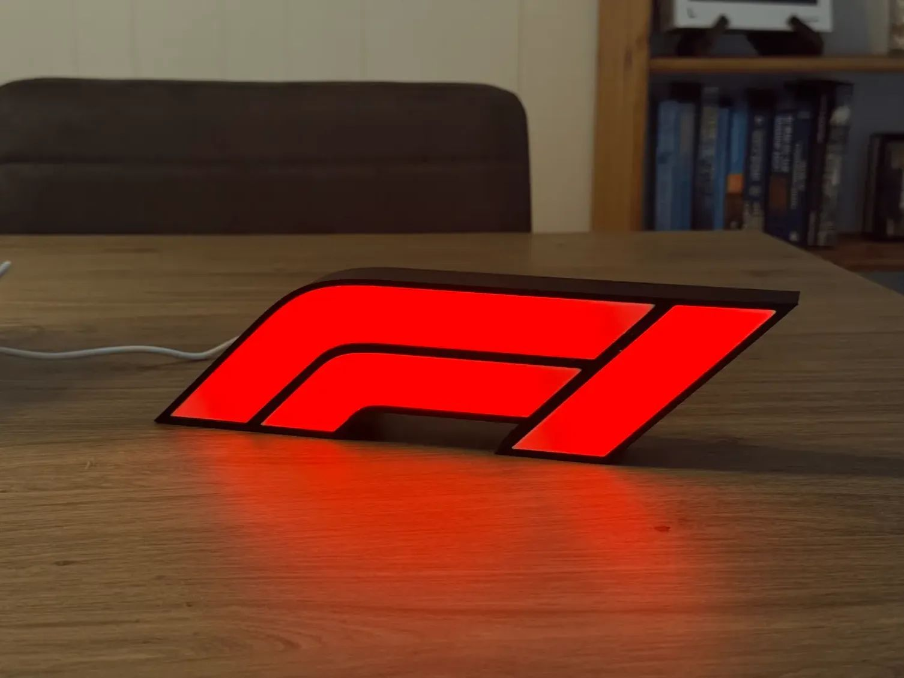

# F1Lamp

An ESP32-C3 Super Mini firmware for the **[F1 WLED Lightbox](https://makerworld.com/en/models/2068365-f1-wled-lightbox#profileId-2233736)** 3D print. It drives three short WS2812B strips (11 LEDs in total) chained on a single data line, and gives you on/off, colour, brightness and a handful of animations — over a built-in web interface, a REST API, or MQTT / Home Assistant.

**Author:** PA1DVB

<p align="center">
  <br>
  <sub>Enclosure photo and 3D model: <a href="https://makerworld.com/en/models/2068365-f1-wled-lightbox#profileId-2233736">F1 WLED Lightbox</a> by <b>JoppeDC</b> on MakerWorld,<br>
  licensed <a href="https://creativecommons.org/licenses/by-nc-sa/4.0/">CC BY-NC-SA</a>. Reproduced with attribution — <b>not</b> covered by this repository's MIT licence.<br>
  The model files themselves are not distributed here; download them from MakerWorld.</sub>
</p>

---

## Hardware

| Component | Value |
|-----------|-------|
| MCU | ESP32-C3 Super Mini |
| LED strips | 3 × WS2812B (or WS2811), chained on one data line |
| Default LED count | 4 + 4 + 3 = **11** |
| Segment layout | Strips **1 + 2** light the **"F"**, strip **3** lights the **"1"** |
| Default data pin | GPIO 4 |
| Default colour | Red (`#ff0000`) |

**Where to buy the ESP32-C3 Super Mini:**
- [AliExpress](https://aliexpress.com/item/1005007783677682.html)
- Search for **"ESP32-C3 Super Mini"** on Amazon

**3D model:** [F1 WLED Lightbox](https://makerworld.com/en/models/2068365-f1-wled-lightbox#profileId-2233736) by **JoppeDC** on MakerWorld

### Wiring

```
ESP32-C3 Super Mini            LED strips (chained)
  5V  ──────────────────────►  +5V   (strip 1 → strip 2 → strip 3)
  GND ──────────────────────►  GND
  GPIO4 ────[330 Ω]─────────►  DIN of strip 1
                               DOUT strip 1 → DIN strip 2
                               DOUT strip 2 → DIN strip 3
```

The three strips are one continuous chain as far as the firmware is concerned: pixel 0 of strip 2 sits at index `strip1_pixels`, pixel 0 of strip 3 at `strip1_pixels + strip2_pixels`. Only the **per-strip LED counts** need to be configured; you can set any of them to 0 if you wire fewer strips.

The firmware knows the logo is made of two glyphs, and effects use that:

| Glyph | Strips | Default LEDs |
|-------|--------|--------------|
| **F** | strip 1 + strip 2 | 4 + 4 = 8 |
| **1** | strip 3 | 3 |

If your build wires the strips in a different order, just swap the LED counts on the configuration page until **Strip Cycle** lights the segments you expect.

A 330 Ω resistor in the data line and a 470 µF capacitor across 5 V / GND are recommended but not required at this small LED count — 11 LEDs at full white draw roughly 0.6 A, well within what the ESP32-C3's 5 V pin can pass from USB.

---

## First Boot — WiFi Setup

On first boot (or after a WiFi reset) the device opens a captive portal access point named after its device ID (e.g. `F1LAMP-AABBCCDDEEFF`). Connect to it with any phone or computer and fill in:

- WiFi SSID / password (selected from a scan list)

All other settings (MQTT, LEDs, colour, effects) are configured through the web interface once WiFi is connected.

The portal closes automatically after 180 seconds of inactivity and reboots the device. If the saved WiFi network is slow to boot, the device waits up to 30 seconds before opening the portal.

| Situation | LEDs |
|-----------|------|
| Connecting to WiFi or MQTT | **Blue blink** (~300 ms on / off) |
| Captive portal open (AP mode) | **Blue breathing** (slow fade in / out) |
| WiFi connected | **Two green blinks** |

---

## Web Interface

Once connected, browse to the device IP address (shown on the serial monitor, or find it in your router's DHCP list).

### Status page — `/`

Displays the device ID, firmware version, current state, colour and effect.

Controls:

- **Turn ON / Turn OFF** buttons
- **Colour picker** — applies and saves immediately
- **Effect** dropdown — applies and saves immediately
- **Brightness slider** — updates the lamp live while you drag, saved when you release

The state badge is refreshed every 3 seconds so changes made through MQTT or the API show up without reloading the page.

### Configuration page — `/config`

| Setting | Description |
|---------|-------------|
| MQTT Enabled | Enable MQTT / Home Assistant auto-discovery |
| MQTT Server | Broker hostname or IP address |
| MQTT Port | Broker port (default 1883; use 8883 for TLS) |
| MQTT Username | Leave blank if not required |
| MQTT Password | Leave blank if not required |
| MQTT Secure (TLS) | Enable TLS encryption (certificate errors are ignored) |
| MQTT Discovery Prefix | Home Assistant / Domoticz discovery prefix (default `homeassistant`) |
| **Test connection** | Button — tries a real broker login using the values currently in the form and reports the result inline. Nothing is saved and a running MQTT session is left untouched. |
| Strip 1 / 2 — LEDs | LEDs in each half of the **"F"** (0–100 each) |
| Strip 3 — LEDs | LEDs in the **"1"** (0–100) |
| LED data pin (GPIO) | Data pin — dropdown restricted to valid ESP32-C3 pins |
| Pixel color order | RGB byte order of the strip (default NEO_GRB) |
| LED signal speed | 800 KHz (WS2812B) or 400 KHz (WS2811) |
| Colour | Colour picker (default F1 red) |
| Effect | Effect selection (see below) |
| Effect speed | 1 (slow) – 10 (fast) |
| Brightness | Overall brightness (1–255) |
| Turn on after power-up | Whether the lamp lights up by itself after a power cycle |

All changes take effect immediately after saving — no reboot needed. Enabling or disabling MQTT blinks the lamp twice to confirm.

### WiFi reset — `/reset`

Clears saved WiFi credentials and reboots into the captive portal.

---

## Effects

| # | Name | Description |
|---|------|-------------|
| 0 | **Solid** | All LEDs on in the selected colour (default) |
| 1 | **Breathe** | Smooth fade in / out between off and the set brightness |
| 2 | **Blink** | Alternates between the two glyphs — **F**, then **1**, then **F** … |
| 3 | **Chase** | A single dot runs through all 11 LEDs |
| 4 | **Race Start** | F1 start procedure — the lights come on one by one, hold, then "lights out"; repeats |
| 5 | **Strip Cycle** | Lights one of the three strips at a time |
| 6 | **Rainbow** | Hue sweep across all LEDs (ignores the colour setting) |

Effects are rendered non-blocking from `loop()`, so the web interface and MQTT stay responsive while an animation runs. **Effect speed** (1–10) controls the step interval of every animated effect.

---

## REST API

The REST API works regardless of whether MQTT is enabled. All endpoints return JSON.

### `GET /api/state`

```json
{
  "state": "on",
  "brightness": 128,
  "color": { "r": 255, "g": 0, "b": 0 },
  "effect": 0,
  "effect_name": "Solid",
  "effect_speed": 5,
  "pixels": 11,
  "ip": "192.168.1.42",
  "rssi": -62
}
```

```bash
curl http://192.168.1.42/api/state
```

---

### `POST /api/state`

Sets one or more values. Only the fields you include are changed.

| Field | Type | Values |
|-------|------|--------|
| `state` | string | `"on"` \| `"off"` \| `"toggle"` |
| `brightness` | integer | 0–255 |
| `color` | object | `{"r":0-255,"g":0-255,"b":0-255}` |
| `effect` | integer or string | effect index (0–6) or name (e.g. `"Race Start"`) |
| `effect_speed` | integer | 1–10 |

**Response:** same format as `GET /api/state` with the updated values.

```bash
# Red, full brightness, solid
curl -X POST http://192.168.1.42/api/state \
  -H "Content-Type: application/json" \
  -d '{"state":"on","brightness":255,"color":{"r":255,"g":0,"b":0},"effect":"Solid"}'

# Start the race-start animation
curl -X POST http://192.168.1.42/api/state \
  -H "Content-Type: application/json" \
  -d '{"state":"on","effect":"Race Start","effect_speed":8}'

# Toggle
curl -X POST http://192.168.1.42/api/state \
  -H "Content-Type: application/json" -d '{"state":"toggle"}'
```

Changes made through this endpoint are written to flash at most once every 10 seconds, so rapid colour fades from an automation will not wear out the flash.

---

### `GET /api/mqtt_test`

Attempts a real broker login and reports whether it worked. This is what the **Test** button on the configuration page calls. Optional query parameters override the stored configuration for the duration of the test only — nothing is written to flash, and an already-running MQTT session is not disturbed (the test uses its own client ID, `<ID>-test`).

| Parameter | Description |
|-----------|-------------|
| `server` | Broker hostname or IP |
| `port` | Broker port |
| `username` / `password` | Credentials; empty means anonymous |
| `secure` | `1` for TLS, `0` for plain |

```json
{ "ok": false, "state": 4, "message": "Bad username or password" }
```

`state` is the raw PubSubClient state code; `message` is the human-readable form of it (`Cannot reach broker`, `Bad username or password`, `Not authorised`, `Broker unavailable`, `Connection timed out`, …).

```bash
curl "http://192.168.1.42/api/mqtt_test?server=192.168.1.10&port=1883&username=hass&password=secret&secure=0"
```

---

### `GET /api/brightness?v=<0-255>`

Live brightness preview — applies immediately but is **not** saved. Used by the sliders in the web interface while dragging.

---

### `POST /api/color`

Fills all LEDs with a single RGB colour immediately. Useful for verifying the **Pixel color order** setting — send pure red, green or blue and check what actually lights up. The effect is temporary; the next state change or animation frame restores the normal display.

```bash
curl -X POST http://192.168.1.42/api/color \
  -H "Content-Type: application/json" -d '{"r":255,"g":0,"b":0}'
```

---

## MQTT / Home Assistant / Domoticz

MQTT is **disabled by default**. Enable it on the Configuration page, fill in the broker details, and press **Save**. The lamp blinks twice to confirm; no reboot is needed.

When enabled, the firmware publishes Home Assistant MQTT Auto Discovery configs and registers **two entities** on one device:

1. A **light** — on/off, brightness, RGB colour and the effect list.
2. A **select** — the effect on its own, so it can be used directly from a dashboard, script or Domoticz without digging into the light's more-info dialog or writing a template.

Both are driven by the same state topic, so they always agree.

| Topic | Description |
|-------|-------------|
| `esp32-f1lamp/<ID>/status` | Availability (`online` / `offline`) |
| `esp32-f1lamp/<ID>/state` | State JSON (read) |
| `esp32-f1lamp/<ID>/command` | Command JSON (write) — light entity |
| `esp32-f1lamp/<ID>/effect/set` | Effect name as plain text (write) — select entity |

**State payload:**
```json
{
  "state": "ON",
  "brightness": 128,
  "color_mode": "rgb",
  "color": { "r": 255, "g": 0, "b": 0 },
  "effect": "Solid"
}
```

**Command payload** (sent by Home Assistant, JSON schema):
```json
{ "state": "ON", "brightness": 200, "color": { "r": 255, "g": 0, "b": 0 }, "effect": "Race Start" }
```

```bash
# via the light entity (JSON)
mosquitto_pub -h <broker> \
  -t "esp32-f1lamp/F1LAMP-AABBCCDDEEFF/command" \
  -m '{"state":"ON","effect":"Race Start"}'

# via the select entity (plain effect name)
mosquitto_pub -h <broker> \
  -t "esp32-f1lamp/F1LAMP-AABBCCDDEEFF/effect/set" \
  -m "Race Start"
```

The select accepts any name from the effect list exactly as spelled in the table above (matching is case-insensitive). An unknown name is ignored and logged to the serial port.

The device ID is `F1LAMP-` followed by the full 6-byte MAC address in uppercase hex (visible on the status page and in the serial log).

---

## OTA Firmware Update

OTA (Over-The-Air) updates are supported via the Arduino IDE or `espota.py`.

- **Hostname:** device ID (e.g. `F1LAMP-AABBCCDDEEFF`)
- **Password:** same as the device ID

In the Arduino IDE the device appears under **Tools → Port → Network ports** after a few seconds.

---

## Serial Log

On boot the device prints a summary to the serial port (115200 baud):

```
App version:  2026.08.13 rev 1.0
LED pin:      GPIO4,  pixels: 11 (4+4+3)
CPU freq:     160 MHz
Device ID:    F1LAMP-AABBCCDDEEFF
MQTT availability: esp32-f1lamp/F1LAMP-AABBCCDDEEFF/status
WiFi: connecting...
WiFi: connected.  IP: 192.168.1.42  RSSI: -58 dBm
```

---

## Configuration Storage

All settings are stored in SPIFFS as `/config.json`. If the filesystem cannot be mounted it is formatted automatically and all settings reset to defaults.

| Setting | Default |
|---------|---------|
| mqtt_enabled | false |
| mqtt_secure | false |
| mqtt_server | `example.tld` |
| mqtt_port | 1883 |
| mqtt_username | *(empty)* |
| mqtt_password | *(empty)* |
| mqtt_discovery_prefix | `homeassistant` |
| strip1_pixels | 4 |
| strip2_pixels | 4 |
| strip3_pixels | 3 |
| led_pin | 4 |
| pixel_color_order | 82 (NEO_GRB) |
| pixel_khz | 800 |
| color_r / g / b | 255 / 0 / 0 (red) |
| base_brightness | 128 |
| effect | 0 (Solid) |
| effect_speed | 5 |
| power_on_boot | true |

---

## Dependencies (Arduino Libraries)

Install via the Arduino Library Manager:

| Library | Purpose |
|---------|---------|
| Adafruit NeoPixel | WS2812B LED control |
| ArduinoJson | JSON serialisation |
| ArduinoOTA | OTA firmware updates |
| PubSubClient | MQTT client |
| WiFiManager (tzapu) | Captive portal WiFi setup |
| WebServer (built-in) | HTTP server |
| SPIFFS (built-in) | Filesystem for config storage |

Board: **ESP32C3 Dev Module** (or compatible) via the ESP32 Arduino core.

> **Partition scheme:** The sketch exceeds the default 1.25 MB app partition because `WiFiClientSecure` (used for MQTT over TLS) pulls in mbedTLS. In the Arduino IDE select **Tools → Partition Scheme → Minimal SPIFFS (1.9MB APP with OTA/190KB SPIFFS)** before uploading. This keeps OTA support and leaves ample room for `config.json` in SPIFFS.

---

## Project Structure

```
F1Lamp/
├── F1Lamp.ino               # Main file: globals, setup(), loop()
├── Config.h                 # All persistent settings + SPIFFS load/save
├── LEDControl.ino           # LED rendering, effects, connection animations
├── MQTTAutoDiscovery.ino    # MQTT state publishing, HA auto-discovery, command callback
├── WebServer.ino            # Web UI handlers + REST API
└── WiFiMqttSetup.ino        # WiFi captive portal, OTA, MQTT reconnect
```

---

## Licence

The firmware in this repository is **MIT** licensed — see [LICENSE](LICENSE).

One file is excluded from that licence:

| File | Licence |
|------|---------|
| `images/f1lamp.jpg` | [CC BY-NC-SA](https://creativecommons.org/licenses/by-nc-sa/4.0/) — photo of the [F1 WLED Lightbox](https://makerworld.com/en/models/2068365-f1-wled-lightbox#profileId-2233736) model by **JoppeDC** on MakerWorld, reproduced with attribution. **Not for commercial use.** |

The 3D model files are not distributed here. This firmware is independent software that drives the LEDs inside the printed enclosure — it is not an adaptation of the model, so the ShareAlike term does not reach the source code.
